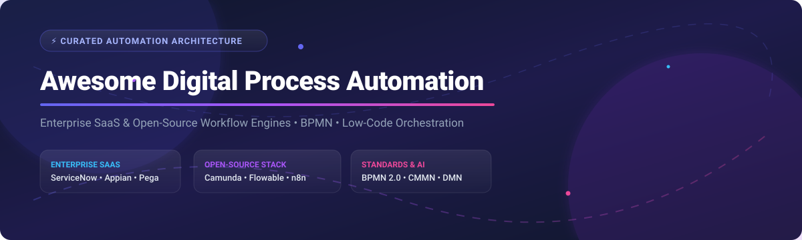

  

# ⚙️ Awesome Digital Process Automation (DPA) 🚀

  
  
  
  
  

## 📌 Top Digital Process Automation (DPA) Ecosystem & Workflow Engines 🌟

**Curated List of SaaS Platforms & Open-Source GitHub Projects**  
*Focused on BPM, Low-Code Workflow Orchestration, Case Management, Intelligent Automation & Enterprise Process Orchestration (BPMN 2.0 / DMN)*  

📅 **Last updated:** October 2026

---

### 💡 Overview & Market Landscape 🌐

The **Digital Process Automation (DPA)** market is estimated at **~$14.5 Billion in 2026** (projected to reach **$28+ Billion by 2030** with a CAGR of ~14.8%). 

📊 **Market Structure & Fragmentation:**  
The DPA market is **moderately fragmented**. 
- **Enterprise Giants & Leaders:** A few market-cap giants (**ServiceNow**, **Appian**, **Pega**) dominate mission-critical enterprise deployments and high-end low-code application platforms.
- **Open-Source & Agnostic Stack:** A thriving open-source and developer-first engine ecosystem (**Camunda**, **n8n**, **Flowable**, **Windmill**) holds significant ground in microservice orchestration, API-first integrations, and custom workflow architectures.

---

## 📑 Table of Contents

- [🏢 SaaS/Hosted Platforms](#-saashosted-platforms)
- [🔓 Open-Source GitHub Projects](#-open-source-github-projects)
- [🛠️ How to Contribute](#️-how-to-contribute)
- [📈 Star History](#-star-history)
- [❤️ Support & Sponsorship](#%EF%B8%8F-support--sponsorship)
- [⚠️ Disclaimer](#%EF%B8%8F-disclaimer)

---

## 🏢 SaaS/Hosted Platforms

The table below summarizes commercial DPA and Low-Code Process Platforms, **sorted descending by company size (Annual Revenue / Valuation)**:

| 🏢 Platform | 💰 Company Size (Revenue / Valuation) | 📝 Description | 💳 Starting Pricing Tier | 🎁 Free Tier / Free Trial Limit |
| --- | --- | --- | --- | --- |
| **[ServiceNow](https://www.servicenow.com/)** | **~$10.9 Billion Annual Revenue** (Market Cap ~$170B) | Enterprise workflow engine & enterprise app development suite. | Custom enterprise quotes (~$100 / user / month baseline add-on) | **Personal Developer Instance (PDI)**: Free non-production dev instance |
| **[Pega](https://www.pega.com/)** | **~$1.4 Billion Annual Revenue** (Market Cap ~$4.5B) | Enterprise AI-powered decisioning and workflow automation suite. | ~$90 / user / month or per-resolved-case custom licensing | **Community Edition**: 30-day free trial (extendable by 15 days) |
| **[Appian](https://appian.com/)** | **~$600+ Million Annual Revenue** (Market Cap ~$2.4B) | Enterprise low-code and intelligent automation platform for complex case workloads. | ~$70–$100 / user / month (Standard Tier) | **Community Edition**: Free perpetual sandbox (1 bot, 25,000 synced DB rows limit) |
| **[Nintex](https://www.nintex.com/)** | **~$350 Million Revenue** (Private Equity / TPG Capital valuation ~$2B+) | End-to-end process management, mapping, and automation platform. | ~$15,000 / year (Cloud deployment baseline entry quote) | **30-day free trial** (90-day trial available for GE government offerings) |
| **[Creatio](https://www.creatio.com/)** | **~$100+ Million ARR** (Valuation ~$1.2 Billion post-$200M raise) | No-code platform for process management and CRM workflow automation. | $40 / user / month (Growth Plan) | **14-day free trial** with full access to Studio and CRM features |
| **[Bizagi](https://www.bizagi.com/)** | **~$80–$100 Million ARR** (Bootstrapped / Private) | Low-code process modeling, simulation, and enterprise execution engine. | Custom usage-based pricing (measured in Bizagi Processing Units / BPUs) | **Bizagi Modeler**: Free perpetual desktop tool for BPMN modeling and simulation |
| **[Kissflow](https://kissflow.com/)** | **~$50+ Million ARR** (Private / Bootstrapped) | Low-code process automation and digital workplace suite. | ~$1,500 / month (Basic Enterprise Plan) | **Free Product Demo** (Free trial available upon sales consultation) |
| **[Pipefy](https://www.pipefy.com/)** | **~$30+ Million ARR** (Total Funding ~$100M+) | No-code workflow management platform for business operations. | $26 / user / month (Business Plan, billed annually) | **Starter Plan**: Free forever up to 10 users, 5 processes, 15 automations/mo, 2GB storage |
| **[Bonitasoft](https://www.bonitasoft.com/)** | **~$25–$30 Million ARR** (Private) | Enterprise BPM platform built on open-source Bonita engine. | Custom annual subscription quote for Enterprise Edition | **Bonita Community Edition**: Free perpetual open-source edition |
| **[ProcessMaker](https://www.processmaker.com/)** | **~$20+ Million ARR** (Private Equity backed) | Low-code BPM and automated workflow orchestration platform. | ~$1,475 / month (Platform tier baseline quote) | **14-day free trial** available upon request via sales demo |

---

## 🔓 Open-Source GitHub Projects

Below is a curated list of top open-source process engines, BPMN orchestrators, and developer workflow platforms, **sorted descending by GitHub Stars_Count ⭐**:

| ⚡ Project | ⭐ GitHub_Stars | 📖 Description |
| --- | --- | --- |
| **[n8n](https://github.com/n8n-io/n8n)** |  | Fair-code workflow automation platform with node-based visual editor and 400+ integrations. |
| **[Camunda 8 (Zeebe)](https://github.com/camunda/zeebe)** |  | Cloud-native distributed BPMN workflow engine designed for microservices orchestration. |
| **[Windmill](https://github.com/windmill-labs/windmill)** |  | Open-source developer platform to turn scripts into workflows, UIs, and automated background jobs. |
| **[Temporal](https://github.com/temporalio/temporal)** |  | Microservices orchestration platform ensuring durable execution for complex distributed workflows. |
| **[Activepieces](https://github.com/activepieces/activepieces)** |  | Open-source no-code business process and AI agent workflow automation software. |
| **[Camunda 7 Platform](https://github.com/camunda/camunda-bpm-platform)** |  | Battle-tested open-source BPMN 2.0 process engine & decision engine for Java environments. |
| **[Flowable](https://github.com/flowable/flowable-engine)** |  | High-performance open BPMN 2.0, CMMN 1.1, and DMN 1.2 engine written in Java. |
| **[Kestra](https://github.com/kestra-io/kestra)** |  | Event-driven declarative orchestrator to build data and business process pipelines as code. |
| **[Activiti](https://github.com/Activiti/Activiti)** |  | Light-weight and operational BPMN business process engine for Java & Spring Cloud. |
| **[jBPM (KIE Tooling)](https://github.com/kiegroup/jbpm)** |  | Red Hat backed open-source flexible Business Process Management (BPM) suite. |
| **[ProcessMaker](https://github.com/ProcessMaker/processmaker)** |  | Open-source PHP/Laravel based workflow engine and digital process automation platform. |
| **[Bonita Engine](https://github.com/bonitasoft/bonita-engine)** |  | Extensible open BPM engine for business process management and enterprise applications. |
| **[CIB seven](https://github.com/cibseven/cibseven)** |  | Open-source community continuation fork of Camunda 7 for long-term production stability. |

---

### 🧩 Open-Source Architecture Patterns 🏗️

- **BPMN 2.0 Core Engines**: Use [Camunda 7/8](https://github.com/camunda/zeebe) or [Flowable](https://github.com/flowable/flowable-engine) for strict compliance and complex state machines.
- **Developer-First Workflow as Code**: Use [Temporal](https://github.com/temporalio/temporal) or [Windmill](https://github.com/windmill-labs/windmill) for code-native resiliency.
- **iPaaS & Visual Automation**: Use [n8n](https://github.com/n8n-io/n8n) or [Activepieces](https://github.com/activepieces/activepieces) for fast API integrations and webhooks.
- **Rules + Processes**: Combine [jBPM](https://github.com/kiegroup/jbpm) with Drools for decision-heavy workflows.

---

## 🛠️ How to Contribute

Contributions are very welcome! 🌟 Follow these simple steps:

1. Fork the repository 🍴
2. Create your feature branch (`git checkout -b feature/awesome-dpa-entry`)
3. Add your entry to `README.md` keeping formatting consistent
4. Submit a Pull Request with a clear description 🚀

---

## 📈 Star History

---

## ❤️ Support & Sponsorship

Thank you for exploring and contributing to this project! 🙏 If you find this curated list of Digital Process Automation tools valuable:

- 🌟 **Star this repository** to help others discover it.
- 🔀 **Fork it** and contribute new tools or updates.
- 📢 **Share** with your process architecture, DevOps, and engineering teams!

☕ **Sponsor & Buy Me A Coffee:**  
If you'd like to support the ongoing maintenance of this awesome list, consider sponsoring on GitHub:

---

## ⚠️ Disclaimer

- This is a **community-curated** list — not exhaustive and not an official vendor endorsement.
- Automated workflows execute operations, transfer sensitive data, and trigger financial transactions. Always implement least-privilege security controls, audit trails, and human-in-the-loop checkpoints in production.
- Open-source engines give full data control and standards compliance (BPMN/DMN) but require software operations management. Commercial platforms offload maintenance but incur recurring licensing costs.

---

**Made with ❤️ for process architects, automation engineers, and enterprise leaders.**
